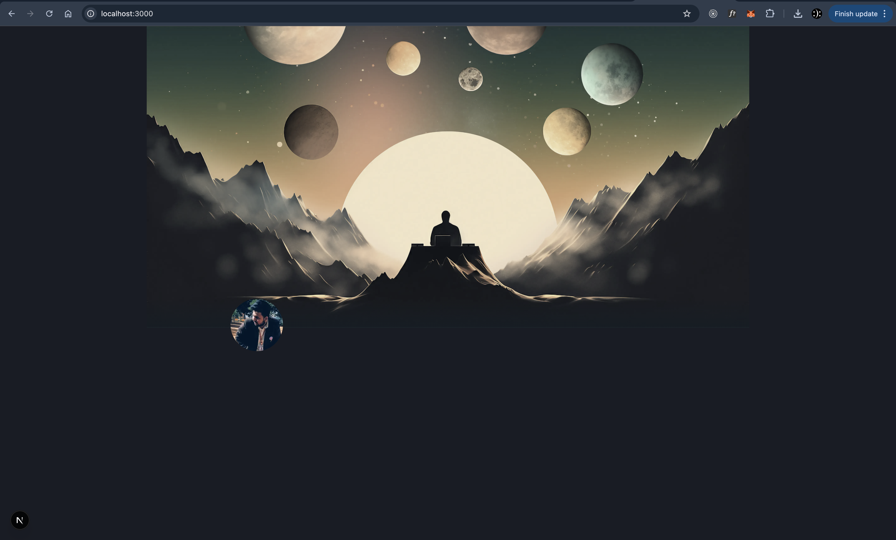

# Amith's NotionFolio

A simple, notion like sub-portfolio for showcasing all my work.

## Tech Stack

**Frontend:**
- Next.js
- TypeScript
- TailwindCSS

## Getting Started

1. Clone the repository:
```sh
git clone git@github.com:AmithBV0606/Notionfolio.git
cd notionfolio
```

2. Install dependencies:
```sh
npm install
```

3. Start the development server:
```bash
npm run dev
# or
yarn dev
# or
pnpm dev
# or
bun dev
```

Open [http://localhost:3000](http://localhost:3000) with your browser to see the result.

You can start editing the page by modifying `app/page.tsx`. The page auto-updates as you edit the file.

## Progress 

### Progress after 2nd commit :

